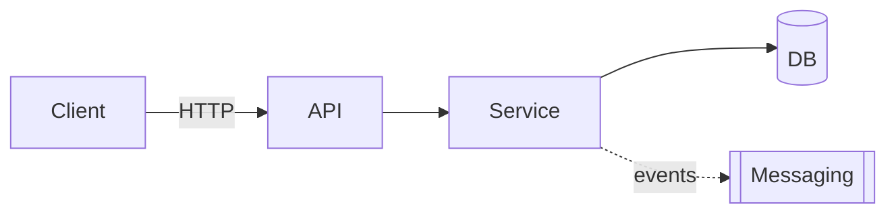

# Target Architecture

> Target architecture of the new system, respecting the paradigm chosen in `paradigm_decision.md` and the strategy confirmed in `migration_strategy.md`.

## Overview

## Diagram (Mermaid)

## Components

| Component | Type | Responsibility | Origin (legacy / new / merged) |
|---|---|---|---|
| <name> | API / Service / Worker / DB / Queue | <text> | <ref to legacy or "new"> |

## Bounded contexts

### BC-01: <name>
- **Responsibility**: <text>
- **Grouping / separation justification**: <why this context was not decomposed 1-to-1 from the legacy>
- **Internal components**: <list>
- **Published events** (if event-driven paradigm): <list>
- **Consumed events**: <list>

<repeat per context>

## Architectural decisions (ADR-style abbreviated)

### AD-01: <title>
- **Decision**: <text>
- **Discarded alternatives**: <list>
- **Justification**: <text, linking to paradigm, strategy, and appetite>
- **Traceability**: <reference to legacy or to discard_log>

## Honor to the chosen paradigm

> Mandatory section when there is a paradigm change. Demonstrates that the architecture honors the decision from `paradigm_decision.md`.

- **Target paradigm**: <from `paradigm_decision.md`>
- **How the architecture honors this paradigm**:
  - <e.g.: event-driven → explicit events, message schemas, eventual consistency strategy>
  - <e.g.: OO with DI → interfaces, injection container, clear boundaries between layers>
  - <e.g.: functional → immutable types, composition, absence of side effects in the domain>

## Edges with the legacy during migration
- <e.g.: during the Strangler Fig, the new API reroutes calls from legacy X until phase Y>

## Notes
<Additional design observations.>
